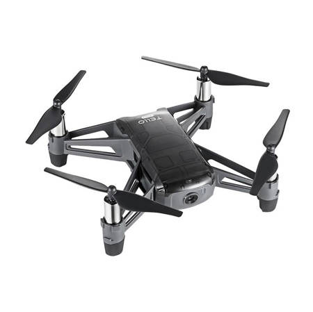
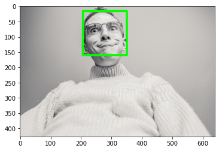

## DJI Ryze Tello flying drone object detection

### Description
This project presents autonomous flying drone which is taking off and rotating until it detects human face.
When face is detected, drone move up and back and then land.
As a drone DJi Ryze Tello Edu was used. Python API refenerence can be found under:
https://github.com/damiafuentes/DJITelloPy/blob/master/README.md
API documentation: https://djitellopy.readthedocs.io/en/latest/tello/

<small>image from https://dji-ars.pl/product-pol-20519-Tello-Edu.html</small>

### Setup
`pip install -r requirements.txt`

### Run flying with face detection
`python fly-drone-recognize-faces.py`

### Project scripts:
Jupyter notebook with example person recognition using GPT-4.1-mini model \
[person-recognition-with-gpt.ipynb](person-recognition-with-gpt.ipynb) 

Python script controlling drone which takes off and lands when person is detected with GPT-4.1-mini model\
[fly-dron-recognize-faces-with-gpt.py](fly-dron-recognize-faces-with-gpt.py) 

Jupyter notebook with example person recognition using haar cascade \
[face-recognition-with-open-cv-haar-cascade.ipynb](face-recognition-with-open-cv-haar-cascade.ipynb)

Python script controlling drone which takes off and lands when person is detected with  haar cascade\
[fly-dron-recognize-faces.py](fly-dron-recognize-faces.py)

For face recognition haar cascade algorithm was chosen implemented in opencv lib
https://github.com/opencv/opencv/blob/master/data/haarcascades/haarcascade_frontalface_default.xml

example usage of haar cascade is shown in notebook face-recognition-with-haar-cascade.ipynb 

<small>original image from https://pixabay.com/photos/man-silly-expression-funny-crazy-869215/</small>
